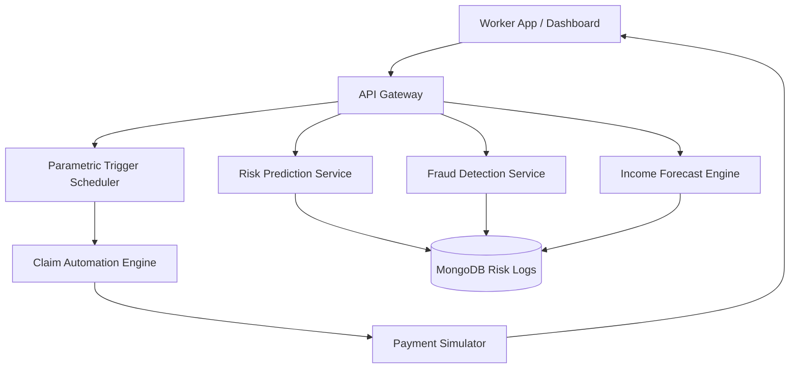

# 🚀 ShieldPay AI

### AI-Powered Parametric Income Protection Platform for Last-Mile Delivery Workers

---

## 🌟 Inspiration

India’s last-mile delivery workforce faces unpredictable income loss due to **extreme weather, logistics disruptions, and urban mobility risks**.
Traditional insurance products are not designed for **real-time, micro-duration gig work protection**.

We were inspired to build an **AI-driven parametric insurance platform** that automatically detects disruptions, predicts income loss, and triggers intelligent payouts — while defending against emerging threats like **GPS spoofing fraud syndicates**.

---

## ⚙️ What it does

ShieldPay AI provides **weekly subscription-based income protection** using predictive analytics and automated claim workflows.

### Key Capabilities

- 🤖 AI-based hyper-local risk prediction
- 💰 Dynamic weekly premium pricing
- 🌧 Real-time disruption monitoring
- ⚡ Automated parametric claim triggering
- 🛡 Multi-layer fraud intelligence engine
- 📊 Predictive insurer liquidity analytics
- 📱 Worker-friendly trust-score driven payout UX

---

## 🧠 Core AI Decision Model

The claim approval probability is computed using a **Trust Score Fusion Engine**:

$$
TrustScore =
0.25M +
0.25D +
0.20E +
0.15H -
0.15F
$$

Where:

| Variable | Meaning                        |
| -------- | ------------------------------ |
| M        | Movement consistency score     |
| D        | Delivery activity signal       |
| E        | Environmental disruption match |
| H        | Historical reliability index   |
| F        | Fraud anomaly score            |

### Payout Tier Logic

| Trust Score | Decision             |
| ----------- | -------------------- |
| ≥ 0.85      | ⚡ Instant payout    |
| 0.50 – 0.85 | ✋ Soft verification |
| < 0.50      | 🔎 Delayed review    |

---

## 🏗 System Architecture



---

## 🔬 AI / ML Pipeline

| Component            | Model / Technique              |
| -------------------- | ------------------------------ |
| Risk Prediction      | XGBoost Classifier             |
| Income Loss Forecast | Regression / Time-Series Model |
| Fraud Detection      | Isolation Forest               |
| Trust Fusion         | Weighted Scoring Engine        |

### Synthetic Feature Engineering

We generated scenario-driven datasets including:

- rainfall intensity
- parcel demand volatility
- GPS jump variance
- delivery inactivity ratio
- nearby claim clustering

---

## 🧩 How we built it

### 🖥 Frontend

- React.js
- Tailwind UI
- Recharts visualization

### ⚡ Backend

- FastAPI microservices
- Async scheduler for disruption triggers

### 🤖 AI Stack

- Scikit-learn
- XGBoost
- Pandas synthetic data simulation

### 💳 Payment Simulation

- Mock Razorpay payout workflow

---

## 💻 Example AI Risk Prediction API

```python
@app.post("/predict-risk")
def predict_risk(features: RiskInput):
    risk_score = risk_model.predict_proba([features.vector])[0][1]
    risk_level = "High" if risk_score > 0.7 else "Moderate"
    return {
        "risk_score": float(risk_score),
        "risk_level": risk_level
    }
```

---

## ⚡ Parametric Claim Automation Logic

```python
if rainfall_mm > threshold and worker_coverage_active:
    trust = trust_engine.compute(worker_features)
    if trust > 0.85:
        payout = "instant"
    elif trust > 0.5:
        payout = "soft_verify"
    else:
        payout = "review"
```

---

## 📊 Dashboard Intelligence

### Admin Analytics

- Premium vs payout liquidity ratio
- Fraud heatmap clustering
- High-risk warehouse prediction

### Worker Dashboard

- Real-time income risk level
- Weekly income forecast
- Trust score breakdown

---

## 🚨 Adversarial Fraud Defense Strategy

Our system defends against **coordinated GPS spoofing attacks** using:

- Mobility sensor pattern validation
- Delivery activity cross-verification
- Graph-based fraud ring detection
- Environmental disruption consensus modelling

This ensures **platform liquidity sustainability** while maintaining fair worker experience.

---

## 🏆 Accomplishments

- Built end-to-end AI parametric insurance workflow
- Designed fraud-resilient payout decision engine
- Created startup-grade predictive analytics UX
- Demonstrated real-time disruption simulation

---

## 📚 What we learned

- Feature engineering is critical in structured risk prediction
- AI automation can transform gig worker financial resilience
- Fraud intelligence must be embedded into core system design
- UX transparency is essential for trust in AI-driven insurance

---

## 🚀 What’s next

- Integrate real logistics platform APIs
- Deploy geospatial risk heatmaps
- Build mobile-first worker app
- Introduce reinforcement learning premium optimization
- Expand to ride-hailing and hyperlocal gig sectors

---

## 🛠 Tech Stack Summary

| Layer         | Technology                |
| ------------- | ------------------------- |
| Frontend      | React + Tailwind          |
| Backend       | FastAPI                   |
| AI Models     | XGBoost + IsolationForest |
| Database      | MongoDB                   |
| Visualization | Recharts                  |
| Deployment    | Docker / Cloud VM         |

---

## 🎥 Demo Flow

1️⃣ Worker purchases weekly policy
2️⃣ System detects severe logistics disruption
3️⃣ AI risk engine evaluates exposure
4️⃣ Fraud intelligence validates authenticity
5️⃣ Trust score decides payout tier
6️⃣ Automated payout simulation executed

---

⭐ _ShieldPay AI reimagines insurance as an intelligent real-time safety net for the future gig economy._
